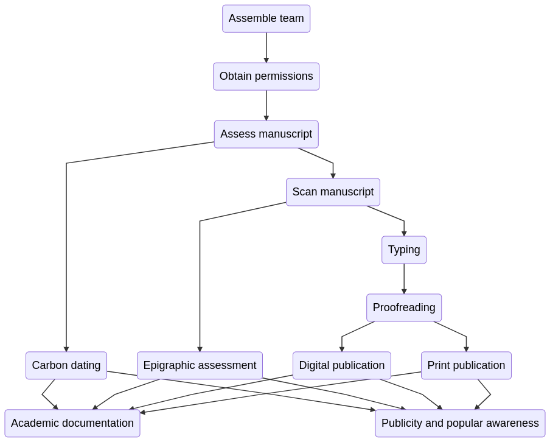
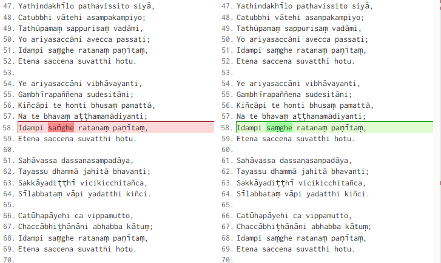

# Dutiya-Parakkamabāhu Cullavagga Transcription Project

- **Draft only!**

## Introduction

In the National Museum of Colombo there rests one of the oldest, and arguably most important, Pali manuscripts found anywhere in the world. It contains the Cullavagga, which consists of chapters 11–22 of the *Khandhaka* portion of the Pali Vinaya. The colophon in the manuscript says that it was copied during the reign of Parākramabāhu II, which would place it in the 13th century. Since almost all our current sources for Pali texts date from manuscripts of the 18th and 19th centuries, it is imperative that the Cullavagga text be digitally preserved and transcribed. In this project outline I set forth a proposal for how to accomplish this.

The aim of the project is to make available to scholars internationally the contents of this work for research. We propose a comprehensive approach to preparing a digital text. This will include the following items:

- Review the manuscript to ascertain the state of preservation.
- Scan the manuscript into high-resolution images.
- Engage an epigraphic expert to assess the script.
- Carbon date the manuscript.
- Have the manuscript carefully typed and proofread.
- Publish digitally and in print.
- Document the project in academic journals and conferences.
- Publicize the project in popular awareness.

To accomplish this will require the cooperation and goodwill of scholars, governmental organizations, and universities.

## Some details and terminology

So far as I know, the manuscript in question has not become known by any accepted abbreviation. For reference purposes, and especially for handling digital resources, it is useful to agree on a clear and consistent abbreviation and referencing system.

### Naming the manuscript

Since the manuscript is said to have been sponsored by King Parākramabāhu II, it seems sensible to name it after him. The Pali term would be Dutiya-Parakkamabāhu. (See [Dīpavaṁsa II 37.84](http://gretil.sub.uni-goettingen.de/gretil/2_pali/3_chron/dipav_2u.htm) *dutiya-parakkamabhuja*.) Thus I propose the following:

- **The manuscript be named the “Dutiya-Parakkamabāhu Cullavagga”, with the acronym DP CV, or `dpcv` for programming contexts.**

<small>Note that, while the Sanskritic form *parākramabāhu* has become standard, in the Pali chronicles it appears as *parakkamabāhu* (or *parakkamabbāhu*). However, in texts such as the [Dīpamavamsa II](http://gretil.sub.uni-goettingen.de/gretil/2_pali/3_chron/dipav_2u.htm) and the [Mahāvaṁsa](http://gretil.sub.uni-goettingen.de/gretil/2_pali/3_chron/mahava_u.htm) the form *parakkamabhuja* is more common. *Bāhu* and *bhuja* are synonyms, both meaning “arm”. In the Mahāvaṁsa, for example, *parakkamabāhu* appears once only, while *parakkamabhuja* occurs 56 times. Until it is edited, of course, we cannot say what form is used in the manuscript itself. The Sanskritic drift of the king’s name is, aptly enough, an example of the kind of problem that we wish to address through studying this manuscript.</small>

### Naming the chapters

The Cullavagga is the second portion of the Khandhaka section of the Pali Vinaya. In the Khandhakas, it is preceded by the Mahāvagga, which consists of 10 chapters. The Cullavagga consists of 12 chapters; hopefully the manuscript contains all twelve, though this remains to be confirmed.

Thus we have:

- Pali Vinaya Khandhakas
  - Mahāvagga (10 chapters)
  - Cullavagga (12 chapters)

So for the numbering of chapters, I propose the following:

- **The chapters of the Cullavagga be named Kd 11–Kd 22, or `kd11`–`kd22` in programming contexts.**

This follows the conventions established on SuttaCentral, where Kd stands for Khandhaka, and the chapters are numbered as a simple increment.

<small>Note that the division between Mahāvagga and Cullavagga is not intrinsic to the texts, and does not correspond to any meaningful division of content. It is merely a division of convenience established for recitation and copying manuscripts. Other Vinayas in Chinese, Sanskrit, and Tibetan lack this division and simply organize this portion of the texts as Khandhakas (Skt. *skandhaka*, sometimes also called *vastu*, etc.).</small>

## Background

The texts of the Pali Tipiṭaka are our most important witness for the original teachings and person of the Buddha. Their significance has always been recognized in Theravada Buddhism, and became known internationally in the 19th century through the work of scholars such as [T.W. Rhys Davids](http://0-www.worldcat.org.novacat.nova.edu/identities/lccn-n50035648/) in England and [Bunyiu Nanjio](http://0-www.worldcat.org.novacat.nova.edu/identities/lccn-n81033028/) in Japan.

Pali texts were traditionally passed down on palm (or *ola*) leaf manuscripts. From the late 19th century into the 20th century these manuscripts have been transcribed and published in book form. From the 1990s the books have been digitized, and are now widely available in several editions on the internet. {See Lewis Lancaster's article "Digital Input of Buddhist Texts" in Damien Keown, Charles S. Prebish, *Encyclopedia of Buddhism*, pp 288–296, Routledge 2013.} All this has greatly increased the availability of the Pali texts and has benefited scholars immensely.

However, in recent years scholars have paid greater attention to the problem of manuscript authenticity. Almost all of the manuscripts in existence date from the 18th and 19th centuries. This means that the entire Pali tradition rests on physical witnesses no more than a couple of centuries old. Linguistic, historical, and other evidence gives us good reason to be confident that the Pali texts are, on the whole, much older than this, and that they substantially date back to the time of the Buddha or shortly after. {See *The Authenticity of the Early Buddhist Texts*, Sujato and Brahmali.} Nevertheless, we should not neglect the opportunity to further test and refine our understanding of the historical provenance of the Pali texts.

A further problem is that almost all the Sri Lankan manuscripts stem from texts that were imported from Burma or Thailand around the 18th century. Thus, although Burma and Thailand originally received their texts from Sri Lanka, we have little evidence for a Sri Lankan transmission that has not passed through those countries. For a discussion of these and other issues regarding the state of Pali manuscripts in Sri Lanka, see Bhikkhu Ñāṇatusita, *Pali Manuscripts of Sri Lanka*. He observes that:

>Given the widespread neglect of collections, the general lack of interest in the preservation of and research into palm-leaf manuscripts in Sri Lanka, and often the considerable difficulty in getting access to collections, it is important that an international project is undertaken to preserve manuscripts by way of digitally photographing or scanning. This should be done in cooperation with Sri Lankan institutes such as the National Archives, universities, and a well-known international institute such as UNESCO, which already manages some important historical sites in Sri Lanka. The digital photographs should not be stored in just one institution, where they might be lost, as happened with the microfilms at the National Archives, but should be made freely available on the internet so that any scholar can access them. Also detailed information (description, history, photographs, list of manuscripts) should be given about the monasteries where the manuscripts were photographed.

While we are not prepared to undertake the more wide-scale digital preservation envisaged by Bhikkhu Ñāṇatusita, by preserving and published DP CV we can, perhaps, stimulate interest and further action.

One of the few early Pali texts in existence was studied and published by Oskar von Hinuber in his *The Oldest Buddhist Manuscript*. This offers a transcription, description, and detailed study of a 8th–9th century Pali manuscript from Nepal by a leading Indological philologist. Von Hinuber suggests that it may have derived from a branch monastery of the Mahāvihāra on the mainland, possibly at Bodhgaya. As it happens, the text itself, while only a few pages, is from the Cullavagga. Thus it is a small portion of the same text found in the DP CV, and when the DP CV is published it will enable a study of the  same passage in manuscripts of the 8th, 13th, and 18th centuries.

When reading Pali texts in modern editions, it is quite evident that a process that might loosely be called “Sanskritization” has taken place, particularly in editions from Burma. We frequently see spelling variations even in common words, such as *supaṭipanna* vs. *suppaṭipanna*, *viriya* vs. *vīriya*, or *byākaraṇa* vs. *vyākaraṇa*. It is generally believed that this process occurred under the influence of medieval grammars such as the Saddanīti, which were based on the Sanskrit grammars. In most cases the spelling variants are inconsequential, and no more affect the meaning than, say, the choice to use UK or American spelling for English. Nevertheless, there are some cases where variant readings can affect the meaning of a passage. Thus it is important for scholars to study the nature of these changes, which can only be rigorously understood through studying early manuscripts or inscriptions.

## Who is involved

A project such as this requires a variety of specialized technical skills and equipment, and can only be accomplished through the cooperation of several parties. We will endeavor to work together with all parties who have an interest in the matter. Here is a preliminary note on relevant parties so far. Note that this is merely a record of initial meetings and does not imply that these people or organizations have made any commitment to the project.

1. **Sri Lankan Department of Archaeology**
   - The Department of Archaeology is the owner of the manuscript, and the governmental institution most directly concerned with preserving and making available Sri Lanka’s ancient culture. We have had a preliminary meeting with Prasanna Ratnayake, the Acting Director General. He indicated that the Dept. would support this project, and may assist in various technical areas.
2. **National Museum of Colombo**
   - The manuscript has been housed here since 1901. We have had preliminary discussions with Mrs. Sanuja Kasthuriarachchi, the Acting Director of the Museum.
3. **Sri Lankan Ministry of Buddhasasana**
   - We have met with Prof. Nimal de Silva, adviser to the Minister, who greeted our project favorably.
4. **University of Sri Jayawardenepura**
   - Ven. Prof. Medagoda Abhayatissa has lent his support to the project in recognition of its importance for Pali studies.
5. **Bhante Sujato of SuttaCentral**
   - The author of this document! I have a special interest in the digital aspects of the project, due to my extensive experience managing digital texts for suttacentral.net.

## How to proceed

Here I will outline what I envisage as the scope of the project. This will have three aspects:

1. Divide the project into task modules, each under the responsibility of a specific partner.
2. Describe a flow or process for completing each module.
3. Present a model for digital management of the project.

## Task modules

In order to achieve the project efficiently and in good time, it is important to break the project down into clear subtasks, each with an agreed body or person to take responsibility. Here is the initial proposal of this.

### Review the manuscript to ascertain the state of preservation

The manuscript appears to be in good condition, but it must be carefully examined before taking any action. This must be done by an experienced expert in the field. Any recommendations must be followed so as to ensure the manuscript is not damaged by the digitization process.

   - **Responsible party:** Department of Archaeology together with National Museum.

### Scan the manuscript into high-resolution images

The manuscript must be scanned carefully, using good quality modern equipment, and undertaken by qualified staff.

<small>There is, apparently, a microfilm of the manuscript, but this is not a good solution. Microfilm is an outdated technology, and it is difficult to find equipment to use it. In addition, it is unlikely that the microfilmed images are of quality comparable to that of modern scans.</small>

The images must be saved in as high resolution as practical. The basic image format must be lossless, which rules out `jpeg`. Ideally the base format would be `tiff`, but `png`, which uses lossless compression, is probably a better option, since the file sizes are much smaller.

The images must be saved using a sensible naming system. Since there is only one manuscript, I propose that we use a simple increment to number the pages, adding “r” and “v” for *recto* and *verso* as needed. Thus the images for the first leaf of the manuscript would be named `dpcv-1r` and `dpcv-1v` and so on. This might seem like a trivial detail, but maintaining a clear and consistent naming convention from the start can avoid a lot of headaches later on.

In addition to scanning the images, it would be advisable to also print a few sets of images. These should be printed professionally, with high resolution on good quality paper using ring binding or similar. Such printed copies, which need not be great in number, would be useful for typists, rather than having to look at a screen; and in addition, print is a more lasting media than digital.

   - **Responsible party:** Department of Archaeology.

### Engage an epigraphic expert to assess the script

The script appears to be an early version of the modern Sinhalese script. It is for the most part readily legible, and anyone familiar with modern Sinhalese should be able to read it. However, it is important that the exact nature of the script be defined as clearly as possible. To this end, an expert in Sri Lankan epigraphy should be engaged.

The examination should aim to provide an independent estimate of the date of the script. Even though we have no reason to doubt the date of the manuscript as given in the colophon, epigraphic evidence can provide important corroboration. After all, it is quite possible that a colophon written at an earlier date is simply copied by a different hand at a later date.

In addition to clarifying the date of the manuscript, epigraphic examination should ascertain any further features of interest in the manuscript, especially such details as may be of use to our typists. We assume that, with a little training, typists and proofreaders will be able to read the manuscript. The epigraphic assessment can verify this and advise as to any potential issues of confusion.

   - **Responsible party:** Department of Archaeology

### Carbon date the manuscript

As noted above, there is at present no reason to doubt the dating of the manuscript. However historical dates are always uncertain and it is wise to confirm them using multiple independent methods wherever possible. Carbon dating is a widely used and relatively reliable method of dating ancient artifacts.

In 2007, radiocarbon dating of Gāndhāri manuscripts in Kharoṣṭhī script placed the oldest of them around 75 CE, making them the oldest extant Indian manuscripts. This project, as well as giving a firm historical context, attracted a great deal of publicity, raising the profile of Buddhist manuscript study. {Allon, M., Salomon, R., Jacobsen, G., Zoppi, U. (2007). Radiocarbon Dating of Kharosthi Fragments from the Schoyen and Senior Manuscript Collections. In Jens Braarvig (Eds.), BUDDHIST MANUSCRIPTS IN THE SCHØYEN COLLECTION vol. III, (pp. 279-291). Oslo, Norway: Hermes Publishing.}

I propose that we carbon date the DB CV, with the aim to confirm or refute the ascription of the manuscript to the 13th century. Together with the colophon and the epigraphic assessment, this will provide a solid basis for dating the manuscript.

The commercial cost of carbon dating is about US $500–$1000, so it is not prohibitive. One possible location to use is the [Australian Nuclear Science and Technology Organisation (ANSTO)](http://www.ansto.gov.au/ResearchHub/OurInfrastructure/acceleratorsciencecentre/Radiocarbondating/index.htm) at Lucas heights, who have done the carbon dating for Gandhari manuscripts, organized by Mark Allon. There is a good possibility that testing can be done here under a grant program that would cover the cost.

   - **Responsible party:** Department of Archaeology, possibly together with Mark Allon at Sydney University through ANSTO.

### Have the manuscript typed and proofread

This is the most critical part of the project, and the one that will take the most time and attention. It is crucial that the manuscript be typed with the utmost fidelity. The typists must avoid any temptation to reconcile or correct the readings. It is precisely the differences between DB CV and modern texts that is of interest.

In typing, it is not necessary to know the language. In fact, familiarity with Pali may be a disadvantage, as it may shape the typists’ perceptions and expectations. Thus I propose:

- **Typing to be undertaken by a commercial typing firm, with proofreading done by Pali scholars or students.**

In a project such as this it is common to have the initial typing done *twice* independently, and the two versions compared. This, as scholars of the Theravada tradition would know, echoes the technique that legend says was used by Acariya Buddhaghosa. It is said that after writing the Visuddhimagga, the devas took it away, and he had to write it again; and then a third time also. Finally all three versions were compared side by side, and not one character was found to differ.

We are lucky these days to have very powerful “diffing” software, which can examine two texts and point out exactly any differences between them. I will describe below how this can be accomplished from a technical perspective.

One of the issues I have encountered in doing this sort of work is that experienced scholars are usually busy and have many projects. So if we expect them to devote many hundreds of hours to a project like this, we may have to wait a long time. Fortunately, much of the work can be done at a reasonable price by less experienced workers. We can then use the scholars’ time efficiently by having them review the final work.

From a project management perspective, I propose the following:

1. Type the manuscript twice by a commercial firm.
2. The two versions are diffed, the differences compared with the manuscript images, and the two versions merged as one.
3. The merged text is further diffed against a modern edition of the same text, and any remaining typos or issues checked once more against the manuscript.

This will, I hope, produce an accurate text. Stages two and three would ideally be done by people with some knowledge of Pali, but they need not be experienced scholars. The job is not to assess the most likely or accurate reading, but simply to check what is in the manuscript. Thus I suggest we may be able to get students or graduates to do this. However it’s possible that even these stages might be done by a commercial firm.

Once a reasonably accurate version is achieved, the final text can be supplied to scholars for perusal at their convenience.

The target script for the typing should be latin, as this has become the international standard. The [ISO 15919](https://en.wikipedia.org/wiki/ISO_15919) conventions should be followed. For the convenience of the typists, it may be easiest to type in [Velthuis](https://en.wikipedia.org/wiki/Velthuis) and convert to ISO 15919.

### Publish digitally and in print

The primary medium for Pali publishing these days is online. Digital text is highly suited to Pali, as it enables us to deal with the large quantity of often obscure works. We will publish the text on SuttaCentral. Our platform will enable a reader to compare the text with other editions, and to see the images next to the text.

In addition, anyone else who wishes to publish the digital text may do so.

If anyone wishes to produce a paper edition, we can support this. SuttaCentral provides a workflow for exporting texts to PDF suitable for high-quality printing.

Since ISO 15919 supports Pali precisely, it is possibly to losslessly convert it to other scripts, especially those of Indic derivation. We do this automatically on SuttaCentral. So anyone who wants to publish in Sinhala or Devanagari script may do so.

### Academic documentation

As the project is of considerable interest to Pali and other Indological scholars, it should be described in international journals. Such essays should document various aspects of the project, including:

1. Linguistic discussion.
2. Historical context.
3. Project methodology.
4. Artwork on the covers.
5. Investigation as to the provenance of the manuscript, and circumstances of its finding and preservation.

### Publicity and popular awareness

The National Museum and/or other bodies may wish to publicize the work to raise awareness of Sri Lanka’s textual history. This might consist of improvements to the museum display, website documentation, leaflets, and so on.

## Flow for completing each module

Here I set out a process for ensuring the efficient completion of the tasks. The principle is that, so far as possible, tasks may be completed in parallel. This means that, unless it is really necessary, none of the team members has to wait for other team members to finish their work. This process is inspired by task management in modern “Agile” processes for teams, which empasizes “release early and often”.

Many of these tasks are of intrinsic value, even if later tasks are not completed. For example, having scanned images available is useful in and of itself, regardless of whether we have a digitized text. So there is no need to wait for the digitization process to be completed before releasing the images. Similarly, carbon dating or epigraphic assessment are of intrinsic interest. These details can be released, also, in a timely manner. Making information publicly available in this way increases interest in a project and demonstrates a commitment to accountability and transparencey.

## Digital Strategy

While it is obvious that we live in a digital age, and the primary product of our work is digital media, it is still rare in the humanities to find a considered appreciation of how to go about a digital project.

Consider our source manuscript. It tells us it was copied by Sumedha Mahāthera on the instructions of the Medhaṅkara Mahāsāmi as part of a donation of giving one book to each monk in Sri Lanka with the patronage of King Parākramabāhu.

Now consider our digital texts. Who were they typed by? Who authorized them? Who sponsored them? What was the process by which the work was done? In most cases, we know none of these things. The texts are produced, vaguely ascribed to an institution, and published in a digital form with little or nothing to tell us how they were made. We have better information about a 13th century manuscript than we do about most of our digital texts.

As a result of poor digital management strategies, it is unfortunately common for years of work to be lost. The Pali text used on SuttaCentral, for example, was rescued from a project by the Dhamma Society of Bangkok. Sadly, the parent organization fell apart and their online presence disappeared. The text, to which they had devoted years of proofing and preparing, vanished. It was only by sheer luck that we located a source that had been copied by a monk. In another case, years of work annotating and preparing a digital version of a Pali dictionary in a German University was permanently lost, as the IT manager resigned and left without sharing the passwords. Prof Lewis Lancaster's article "Digital Input of Buddhist Texts" contains several more such sad stories of work gone to waste.

We can do better. What, we should ask, is the gold standard for creating and maintaining digital projects? In my view, the answer is this: it is what programmers use for their own projects. What we are producing is, in fact, just code. At its core it is binary data, no different from what programmers produce.

### Use Github for all assets

For many years, SuttaCentral has managed its code and source texts at Github. Github is a public cloud service for hosting code and files using the open-source Git version control system. Github is extremely stable and secure, being used by major software companies such as Google, Microsoft, and Facebook for their own code.

The great advantage of using Github is that it preserves every detail about *what* changes are made, *who* changed it, *when* they changed it, and (optionally but recommended) *why* they changed it. These are recorded in an indelible and publicly accessible form on Github. On Github, *nothing is ever deleted*. So if any mistake is made, no matter how small or large, we can always revert it back to the prior state. This means that we can preserve a forensic level of detail and accuracy in all our doings, setting a standard for reliability and transparency that is unprecedented in any comparable projects.

Github is free and simple to use. Anyone with access to the Github account can add or alter assets. No special software is needed; it can be done simply via a browser. For team members, it will be useful to set up a local version of the Github repository. (In Git terminology, a “repository” or “repo” is a folder that contains a set of files for a project.) Local tech support can set this up; because we’re using the same tools that programmers use themselves, pretty much every programmer will know how to do this.

Since Github is designed as a workshop for creating programs, any data and files may be exported (“forked”) into other applications. Thus the data may be made use of by many different projects. In addition, this encourages the creation of multiple redundant copies, thus ensuring the survival of the information.

Thus I propose:

- **All digital assets of the project—including text, images, reports, and essays—be maintained in a single Github repository.**

### Segmenting the text

Segmenting of text refers to breaking it into meaningful semantic segments, for example, a sentence. This aids looking up the appropriate segment, and also helps computers process the difference between texts.

Segments will almost always be the same in different editions, since variations are usually at a smaller scale (a word or letter).

SuttaCentral uses a segmented text based on the Mahāsaṅgīti edition of the Sixth Council. Let us use this as the reference edition. Here is a sample of a segmented text in SuttaCentral’s system, taken from the first discourse of the Saṁyutta Nikāya.

    #. </h1>

    #. 
    #. 
    #. 
    msgctxt “sn1.1:1.1”
    msgid “Evaṃ me sutaṃ—​"
    msgstr “So I have heard.”

    msgctxt “sn1.1:1.2”
    msgid “ekaṃ samayaṃ bhagavā sāvatthiyaṃ viharati jetavane anāthapiṇḍikassa ārāme.”
    msgstr “At one time the Buddha was staying near Sāvatthī in Jeta’s Grove, Anāthapiṇḍika’s monastery.”

Here there is a rich set of data that is associated with each segment. We have:

1. HTML markup, for presentation on the web.
2. Reference details for multiple published editions.
3. An ID number that uniquely identifies each segment.
4. The Pali text itself.
5. An English translation. (Other languages can be easily added.)

Normally, it is a lot of work to create and coordinate such rich data associated with a text. Using conventional tools such as word processors, there is no simple way to import the data from one edition to another. However, for us this is trivial. To create our DB CV edition, we first strip all the data from the reference edition, keeping only the Pali text. This gives us the following:

        Evaṃ me sutaṃ—
        ekaṃ samayaṃ bhagavā sāvatthiyaṃ viharati jetavane anāthapiṇḍikassa ārāme.

Even though there is no metadata at all, we can keep the segments coordinated with the original file by simply counting the line numbers: one line = one segment.

When our typists are working on the DP CV, they will keep one window on their computer to see this reference edition. Each time they come to a new segment, they mirror the reference edition by pressing <kbd>Enter</kbd> to create a new line. By this extremely simple method we can integrate our new edition with all the rich associated data from the reference edition.

### Text input

The text of each manuscript is to be inputted as accurately and literally as possible. There is no editorial input; no corrections, identifications of variants, and the like. Texts are romanized, but without adding punctuation, capitals, or any other features. This keeps the job of the typist as simple as possible.

I recommend using the open-source text editor Atom for this process. It can be used on any operating system, and comes with native Github integration (in fact it is built by Github). Whenever the typists save their work it will be automatically synchronized with the central repository on Github.

Here is how the text is created.

1. Create a new text file with the ID of the appropriate chapter, let us say `kd1`.
2. Type exactly what is on the page.
2. At the end of each line in the manuscript, insert an arbitrary glyph, let us say `$`.
3. At the end of each page in the manuscript, insert a (different) arbitrary glyph, let us say `#`.
4. Text is segmented by adding a new line (i.e. hit <kbd>Enter</kbd> for each new segment.)

That’s all that is required to create a new digitized edition.

There is no need to write line and page numbers in the text. They can be calculated at the end of the project.

As mentioned above, I recommend having the source text typed twice by independent workers. Then the two versions can be “diffed” and the differences resolved. If you’re not familiar with how diffing works, here is a sample from two editions of the Ratana Sutta.

The diff engine compares the two texts and highlights any differences. This is made easy when using a segmented text, as the differences are kept to each pair of lines. So the job of the proofreader will be to resolve each case where the digital texts diverge, referring back to the original manuscript for reference.

I recommend that this process be done twice: once by comparing the two typed files of the DB CV edition, and again by comparing the merged DB CV file against the reference Mahāsaṅgīti edition.

Once the typing is finished, we calculate the line and page numbers of the manuscript based on the inserted glyphs. Then this reference data can be added to the set of data for all the editions. The newly typed text can be imported into the metadata structure as seen above, and then used for display, reference, translation, and so on.

## Bibliography

Allon, M., Salomon, R., Jacobsen, G., Zoppi, U. (2007). Radiocarbon Dating of Kharosthi Fragments from the Schoyen and Senior Manuscript Collections. In Jens Braarvig (Eds.), BUDDHIST MANUSCRIPTS IN THE SCHØYEN COLLECTION vol. III, (pp. 279-291). Oslo, Norway: Hermes Publishing.
